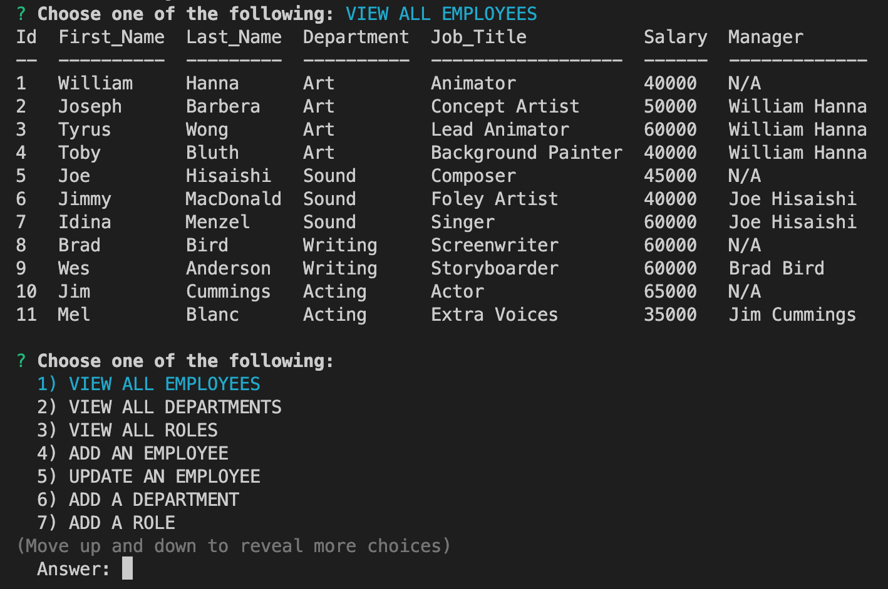

 # Employee Tracker

## Table of Contents
- [Description](#description)
- [Visuals](#visuals)

## Description
This is a user-run employee tracker! Using node.js, the user will be prompted with a series of options. These options will allow the user to view their employees, departments, and roles as well as add new employees, departments, and roles. Users will also be able to update their employees.

## Visuals

